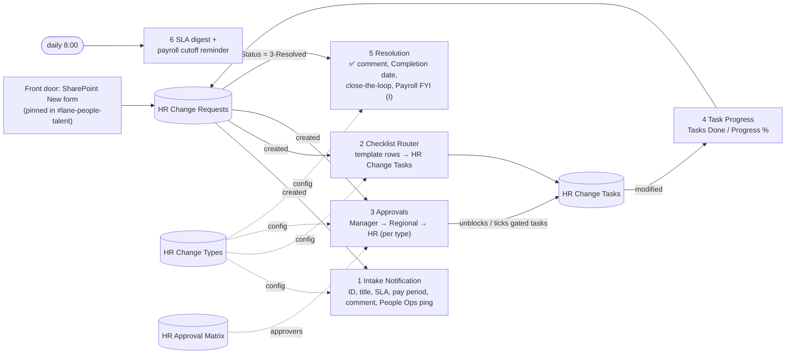

> **Superseded.** This five-list build is kept for reference only. The current design (one SharePoint list + Excel reference tables) is in [`../../README.md`](../../README.md).

# HR Change + Orchestration (SharePoint list + Approvals)

## Summary

This is the **HR Change + Orchestration** plan (Project 10k: People Team Owned Automations, Steps 5, 5b, 6) with the
HR Change **Slack List** replaced by a **SharePoint list** as the system of record, and **approval routing** added.
Slack stays where people already work: the front door link is pinned in `#lane-people-talent`, and the People Ops
room, Payroll room and managers channel get the notifications.

Guiding principles carried over from the plan:

* **One front door.** One form (the SharePoint list *New* form) with universal fields and conditional fields per change type.
* **Not in the intake, does not exist.** Every case is an item on **HR Change Requests**.
* **Templates do the thinking.** Each change type's checklist (A1–I) is data in **HR Change Templates**. Every new
  request gets its own copy as real subtasks, with a progress bar.
* **The item is the work log.** Item comments replace the Slack List thread: intake, checklist, approvals and resolution are all logged there.
* **Offboarding is a path, not a separate system.** Same form, same list, same engine.



## Slack plan → this build

| In the Slack plan | Here |
|---|---|
| HR Change Slack List | **HR Change Requests** SharePoint list (same fields, plus approval and progress fields) |
| Workflow Builder form (universal + change-type dropdown) | List *New* form with [show/hide formulas per change type](assets/form-conditional-formulas.md) |
| Flow 1 — Intake Notification (create item → ping People Ops) | **hrc-1-intake-notification**: Request ID `HRC-000123`, Request title `[Change Type] — [Employee Name]`, SLA due date, Slack ping, confirmation email to submitter |
| Flow 2 — Checklist Router (10 paths + "Other" catch-all, checklist posted to the item thread) | **hrc-2-checklist-router**: one generic flow reads the template rows for the change type and creates **real subtasks**. This is Phase 2 "true subtask duplication", done without a webhook or the Slack API. A type with no template gets the "needs manual scoping" note |
| Master template items on the list (never completed) | **HR Change Templates** list (standing SOP reference). Edit a checklist there and new requests pick it up; no flow edits |
| Approval steps written as checklist text ("Route approval → manager + Regional") | **hrc-3-approvals**: real sequential approvals per the approval chain in **HR Change Types**. The "Route approval" step ticks itself; "On approval: …" steps stay *Blocked* until approved |
| Completion auto-comment (✅ Resolved on [date] by [assignee] + stamp Completion date) | **hrc-5-resolution**, word for word, plus close-the-loop email and auto-ticking of "Mark complete / Close the loop / Log completion" tasks |
| Flow 3 — Payroll Notification (Template I only, one-way, not a gate) | Also **hrc-5-resolution**: when the HR Change Types row has *Notify Payroll on Resolve*, Payroll gets an FYI in their Slack room |
| Nice to add — automated cutoff reminder | **hrc-6-daily-sla-and-cutoff**: N business days before each semi-monthly cutoff, posts to managers with the form link |
| Phase 3 — dashboard view (open by age, SLA compliance, by type) | List views *Open by SLA*, *My cases*, *0-New (pick me up)*, *Awaiting approval*, *By change type*, plus the daily SLA digest in Slack |
| Status labels (Tag, You're It) | Unchanged: `0-New`, `1-Assigned`, `2-Waiting`, `3-Resolved`, plus **Outcome** (Completed / Rejected / Withdrawn) |

## Approvals

Approval chains live in **HR Change Types** (Approval Stage 1–3), so you can change them when the approval matrix is signed off.
Seeded from your templates:

| Change type | Approval chain | Then |
|---|---|---|
| B — Job / Status | Manager → Regional | Paycor update and Directory sync tasks unlock |
| C — Comp | Manager → Regional → HR | Payroll notify and Paycor tasks unlock |
| F — Time / PTO | Manager | "Log in Paycor" unlocks |
| I — Extra Shift | HR | Paycor earning setup unlocks |
| A1, A2, D, E, G, H | none | — |

* **Who approves:** *Manager* comes from the request's **Manager** person field. *Regional*, *HR* and *Payroll* come from
  **HR Approval Matrix** rows matched on the request's **Region** (falling back to a `*` row).
* **Sequential, stops at first rejection.** Each decision is posted as an item comment and appended to *Approval History*.
* **While waiting:** Status = `2-Waiting`, Approval Status = `Pending`, Current Approver = `Regional: name@…`.
* **Approved:** Status → `1-Assigned` (or `0-New` if nobody owns the case yet), and gated tasks unlock.
* **Rejected:** Status → `3-Resolved` with Outcome *Rejected*. Open tasks are cancelled and the requester is told why.
* **No approver found** (empty Manager, or no matrix row): Approval Status = *Needs approver* and the People Ops room is alerted.
* Approvers act from the **approval email**, the Power Automate app or Teams. The request details are in the approval itself,
  so approvers don't need access to the list. In-Slack approve buttons stay a Phase 3 item (bot token).

## Flows

| Flow | Trigger | Notes |
|---|---|---|
| hrc-1-intake-notification | Request created | SLA = submission + N business days (weekends skipped, holidays not), or the last day / effective date for offboarding, or none for LOA. For type I: pay period + *Submitted after cutoff* flag |
| hrc-2-checklist-router | Request created | Separate from #1 so one failing can't take the other down (as in the plan) |
| hrc-3-approvals | Request created | Waits up to 30 days per stage |
| hrc-4-task-progress | Task modified | Updates Tasks Done / Progress %. Comments and pings once all tasks are done (LOA stays open) |
| hrc-5-resolution | Request modified, Status = 3-Resolved and no Completion date | Runs once per resolution. Clear Completion date to re-run it |
| hrc-6-daily-sla-and-cutoff | Daily 8:00 | Weekday SLA digest (overdue, due today, unpicked 0-New, LOA returns within 7 days). Cutoff reminder |

Every flow has Try/Catch, and failures email `adminEmail` a link to the failed run.

## Decisions I made that you should check

1. **Front door = SharePoint list form**, linked from Slack. A Slack Workflow Builder form can't write to SharePoint without
   an app or bot token. The flows trigger on *item created*, so any front door that creates the item works the same:
   Microsoft Forms, Power Apps, or the [`hr-ticketing-triage`](../hr-ticketing-triage) email flow.
2. **Template I: Payroll is a verifier, not a gate.** Your plan says both. The Flow 3 section says "not a gate", but the master
   reference has "Step 3 — Payroll final approval". I followed Flow 3. To make Payroll a gate, set *Approval Stage 2 = Payroll*
   on the I row in **HR Change Types**.
3. **Manager Name → Manager (person picker)**, so manager approvals can route. It still shows the name.
4. **"Approval confirmed (Y/N)" on Comp is dropped.** The in-system approval replaces it.
5. **"deparHRent" → "department".** It looks like a find-and-replace of "tm" → "HR" hit the plan. Worth checking the
   original doc for other spots ("department", "attachment", "settlement"…).
6. **Item-level permissions** on HR Change Requests: submitters see and edit only their own requests. HR site owners see everything.
7. **Your open question:** *"Should the manager DM come from a Slack app (bot token) or the Power Automate Slack connector?"*
   This build uses the **Power Automate Slack connector**. It signs in with OAuth as the connecting user, so it needs no bot token
   and no IT app approval. Posts appear from that user, so connect it with a People Ops service account if you have one.
   DMs to a specific manager need their Slack member ID, so the flows post to channels.

## Setup (Minimal Path to Awesome)

> **Prefer to build it by hand, one flow at a time?** Follow [`manual-build/`](manual-build/README.md). You create the lists
> from CSV files and build each flow in the designer with copy-paste expressions, testing as you go. No solution import needed.


1. **Lists:** run
   `./scripts/Provision-HRChangeLists.ps1 -SiteUrl https://<tenant>.sharepoint.com/sites/PeopleOps -ClientId <pnp-app-id>`.
   It creates the 5 lists, columns and views, and seeds the 11 change types, templates A1–I and a starter approval matrix.
   Then edit **HR Approval Matrix** and **HR Change Types → Default Assignee Email** with real people (G is seeded to CJ).
2. **Form:** add the show/hide formulas from [`assets/form-conditional-formulas.md`](assets/form-conditional-formulas.md).
3. **Import** [`solution/hr-change-orchestration.zip`](solution/hr-change-orchestration.zip) in Power Automate →
   Solutions. Connections: SharePoint, Office 365 Outlook, Approvals, Slack. Use an account with Full Control on the site,
   so it can read every request despite item-level permissions.
4. **Environment variables:** the site, plus the five list titles (the defaults match the script) and `hrc_Settings`:

   | Key | Value |
   |---|---|
   | `slack.intakeChannel` / `payrollChannel` / `managersChannel` | Slack channel IDs (channel → *View channel details* → bottom) |
   | `payrollCutoffDays` | Day of month of the cutoff for the 1st–15th period and for the 16th–end-of-month period, e.g. `[10, 25]` |
   | `cutoffReminderBusinessDays` | `2` = remind managers 2 business days before each cutoff |
   | `intakeFormUrl` | The New form URL the script prints |
   | `adminEmail`, `timeZone`, `requestPrefix`, `sendSubmitterConfirmation` | |

5. Open each flow once and check the **Slack → Post message** and **Approvals** actions show their fields. Re-select the
   channel there if the designer asks. Turn the six flows on.
6. **Test in the order from your build guide:**
   * **E — Personal Data Change** first: checks the plumbing (ID, SLA, comment, 5 tasks, ping, resolve → ✅ comment + close-the-loop).
   * **I — Extra Shift** second, the live pilot. Use the ICS cases: DVA at $100/hour and the $800/day flat rate, first days worked
     Aug 15. Check the HR approval, the pay period and cutoff flag, and the Payroll FYI on resolve.
   * **G — LOA** third: assigned to CJ, no SLA, stays open, and shows in the digest when the return date is near.
   * Then **C — Comp** to exercise the full 3-stage approval chain, including a rejection.
7. Pin the form link in `#lane-people-talent` and tell managers about the front door policy.

## What's next (Phase 2 items not built yet, blocked on your dependencies table)

| Item | Waiting on | How it slots in |
|---|---|---|
| Jira ticket (access revocation + equipment) for A1/A2 | Jira connector access, HR project in Jira | Add to the router after task creation for A1/A2, and write the link into *Jira Ticket Link* |
| Termination letter / comp / job change confirmations | Word templates with content controls | *Word Online → Populate a Microsoft Word template* (premium) on approval or on resolve |
| Monday payroll board / backfill link | Board, column and form URL | *Monday.com* connector step in the C and A1/A2 paths |
| Offboarding distro email | Distro address | A task today (timing-sensitive for A2). Can be automated once the address is confirmed |
| Paycor write-back | Paycor iPaaS / bot token (Phase 3) | Replace the "Update Paycor" tasks |

## Compatibility


SharePoint, Office 365 Outlook, Approvals and Slack are all standard connectors.

## Contents

```
hr-change-orchestration/
├── solution/hr-change-orchestration.zip       unmanaged solution (6 flows, 7 env variables, 4 connection references)
├── sourcecode/                                unpacked solution
├── assets/
│   ├── sp-list-config.json                    5 lists and every column (internal names used by the flows)
│   ├── change-types.json                      SLA, approval chain and notifications per change type + approval matrix seed
│   ├── checklist-templates.json               Templates A1–I from the plan, with automation/gating flags
│   ├── form-conditional-formulas.md           show/hide formulas for the conditional intake fields
│   └── hrc-settings.json                      default value of hrc_Settings
└── scripts/
    ├── Provision-HRChangeLists.ps1            lists, columns, views, item-level permissions, seed data
    ├── validate.py                            static checks of the flow definitions
    └── pack.py                                builds the solution zip (or use pac solution pack)
```

## Version history

Version|Date|Comments
-------|----|--------
1.0|October 6, 2026|Initial release: Slack List replaced by SharePoint, approvals added

## Disclaimer

**THIS CODE IS PROVIDED *AS IS* WITHOUT WARRANTY OF ANY KIND, EITHER EXPRESS OR IMPLIED, INCLUDING ANY IMPLIED WARRANTIES OF FITNESS FOR A PARTICULAR PURPOSE, MERCHANTABILITY, OR NON-INFRINGEMENT.**
