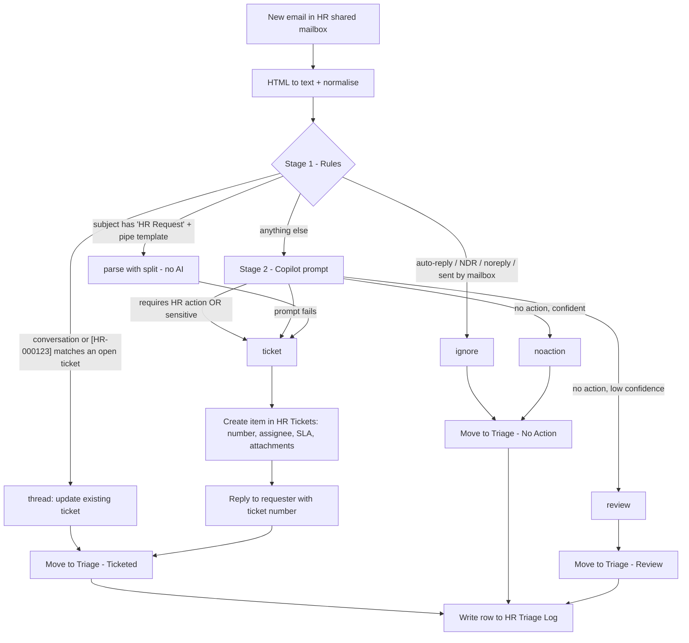

# HR Shared Inbox Ticketing & Triage (Power Automate + Copilot)

## Summary

An HR shared mailbox gets everything: real requests, newsletters, out-of-office replies, "thanks!" emails,
vendor marketing and system notifications. This solution reads every incoming email and creates a
ticket in a SharePoint **HR Tickets** list **only when the HR team actually has to do something**.
Every other email is filed and logged, with no ticket created.

Triage runs in two stages, so the AI is only used where it adds value:

1. **Rules (free, deterministic):** auto-replies, NDRs, meeting responses and `noreply` senders are ignored.
   Replies on an existing ticket are attached to that ticket instead of creating a duplicate. Emails that use
   the standard HR request template are parsed with `split()`, like the
   [reference video](https://youtu.be/iA3dYLQbeIw) does.
2. **Copilot (AI Builder prompt):** any email that's left is classified by a prompt that returns JSON:
   *requires HR action?*, confidence, category, priority, sensitive, summary and requested action.

Tickets are auto-assigned from a category routing map and get an SLA due date. The requester receives an
acknowledgement with the ticket number, gets a resolution email when HR resolves the ticket, and HR gets
a daily digest of overdue tickets and tickets that need triage.



## How this builds on the reference video

| Video ("How To Parse Emails and Populate SharePoint Lists") | This solution |
|---|---|
| Trigger: *When a new email arrives* with subject filter **"Ticket"** | Trigger: *When a new email arrives in a **shared mailbox***, with no subject filter. A subject filter silently drops real requests that don't use the keyword, so the keyword (`HR Request`) is only a fast path |
| Users must send a standardized template, parsed with `split(body('Html_to_text'), '\|')[1]`, `[3]`, `[5]`, `[7]` | Same `split()` technique for templated emails (no AI cost). Free-form emails go to **Copilot** instead of being rejected |
| Only "Ticket" emails become list items | Rules + Copilot decide what is actionable. Everything else is filed and logged |
| *Create item* + *Add attachment* in *Apply to each* | Same, plus inline signature images are skipped, and nothing is copied for sensitive tickets |
| Suggested next steps: error handling, assignment, resolution notifications | Try/Catch with admin alert and fail-safe ticketing, routing map + SLA, resolution email flow, daily digest, auto-close |

## Flows

| Flow | Trigger | What it does |
|---|---|---|
| **hr-inbox-triage** | New email in the shared mailbox Inbox | Rules → (template \| Copilot) → ticket / thread update / no action / review. Then moves the email and logs the decision |
| **hr-ticket-resolution-notify** | HR Tickets item modified, with **Status = Resolved** and `ResolutionNotified` not set | Emails the requester the `ResolutionNotes` from the shared mailbox, then sets `ResolutionNotified` and `ResolvedOn` |
| **hr-ticket-daily-digest** | Weekdays 07:45 | Emails HR the open, overdue and *Needs Triage* tickets. Closes *Resolved* tickets after `autoCloseResolvedAfterDays` |

### hr-inbox-triage routes

| Route | When | Ticket? | Email moved to |
|---|---|---|---|
| `ignore` | Sent by the mailbox itself, sender matches `ignoreSenderPatterns`, or subject starts with one of `ignoreSubjectPrefixes` | No | Triage - No Action |
| `thread` | Same Outlook conversation, or `[HR-000123]` in the subject, matches a ticket that isn't Closed | Updates it (`ReplyCount`, `ThreadLog`, `LastActivity`; *Waiting on Requester*/*Resolved* → *Requester Replied*) | Triage - Ticketed |
| `ticket` | Template matched, or Copilot says HR action is required or the email is sensitive, or Copilot failed | Yes (*New*, or *Needs Triage* when confidence is below the threshold) | Triage - Ticketed |
| `noaction` | Copilot: no action, confidence ≥ `confidenceThreshold` | No | Triage - No Action |
| `review` | Copilot: no action, confidence < `confidenceThreshold` | No | Triage - Review |

Design choices:

* **Fail-safe, not fail-silent.** If the prompt errors, times out or returns invalid JSON, the email still becomes
  a *Needs Triage* ticket. If the whole flow fails, the email stays in the Inbox and the admin gets a link to the run.
* **No duplicate tickets.** Replies are matched by conversation id *or* ticket number. The acknowledgement
  subject includes `[HR-000123]` so the match still works when the requester starts a new email thread. The trigger
  runs with concurrency 1, so two replies arriving together can't race.
* **Model output is validated.** A category or priority outside the allowed lists becomes `Other` / `Medium`.
  The prompt treats the email body as untrusted data, which covers prompt injection (see `sample-emails.json`).
* **Sensitive matters** (harassment, medical, legal and similar) are always ticketed and assigned to
  `sensitiveAssignee`. The body is not stored in SharePoint and attachments are not copied.
* **Everything is auditable.** Every email gets a row in *HR Triage Log* with the decision, the reason and a run
  link. HR fills in **HumanVerdict** to tune the prompt and the threshold.

## Applies to

* [Microsoft Power Automate](https://learn.microsoft.com/power-automate/)
* [AI Builder prompts / Copilot prompts](https://learn.microsoft.com/ai-builder/create-a-custom-prompt)
* SharePoint Online, Exchange Online shared mailbox

## Compatibility


*Run a prompt* uses the Microsoft Dataverse connector (premium) and consumes AI Builder or Copilot Credits.
The rules stage and the template fast path keep that usage to genuinely new, free-form emails.

## Version history

Version|Date|Comments
-------|----|--------
1.0|October 6, 2026|Initial release

## Contents

```
hr-ticketing-triage/
├── solution/hr-ticketing-triage.zip         unmanaged solution to import
├── sourcecode/                              unpacked solution (pac solution pack / scripts/pack.py)
│   ├── Workflows/                           3 flow definitions
│   ├── environmentvariabledefinitions/      6 environment variables
│   └── Other/                               Solution.xml, Customizations.xml (4 connection references)
├── assets/
│   ├── triage-prompt.md                     Copilot prompt instructions + JSON output format
│   ├── triage-settings.json                 default value of the hrt_TriageSettings env variable
│   ├── sp-list-config.json                  HR Tickets + HR Triage Log columns
│   ├── hr-request-email-template.txt        the optional standard template (split() fast path)
│   └── sample-emails.json                   test cases with expected routes
└── scripts/
    ├── Provision-HRTriageLists.ps1          creates both lists, columns, indexes and views (PnP.PowerShell)
    ├── validate.py                          static checks of the flow definitions
    └── pack.py                              builds the solution zip without pac
```

## Minimal Path to Awesome

### 1. Shared mailbox and folders

1. Use an existing shared mailbox (for example `hr@contoso.com`). Give the account that will own the connections
   **Full Access** and **Send As** (or Send on Behalf) on it.
2. Under the mailbox **Inbox**, create three folders: `Triage - Ticketed`, `Triage - No Action`, `Triage - Review`.
3. Get the folder ids. In [Graph Explorer](https://developer.microsoft.com/graph/graph-explorer), run
   `GET https://graph.microsoft.com/v1.0/users/hr@contoso.com/mailFolders/inbox/childFolders?$select=id,displayName`
   and copy each `id`. (If you would rather not move emails, set `"moveEmails": false`.)

### 2. SharePoint lists

```powershell
./scripts/Provision-HRTriageLists.ps1 -SiteUrl https://contoso.sharepoint.com/sites/HR -ClientId <pnp-app-id>
```

The script creates **HR Tickets** and **HR Triage Log** with the columns in
[`sp-list-config.json`](assets/sp-list-config.json). It indexes `ConversationId`, `TicketNumber`, `Status`,
`DueDate` and `ResolvedOn`, and adds the *My open tickets*, *Needs triage* and *All open* views.
To create the lists by hand instead, use the same internal column names.
Restrict who can open **HR Tickets**: HR only.

### 3. Copilot prompt

Create the **HR Inbox Triage** prompt by following [`assets/triage-prompt.md`](assets/triage-prompt.md), test it
with [`sample-emails.json`](assets/sample-emails.json), and copy its Id.

### 4. Import the solution

1. In [Power Automate](https://make.powerautomate.com) → **Solutions** → **Import solution**, choose
   [`solution/hr-ticketing-triage.zip`](solution/hr-ticketing-triage.zip).
2. Create or select connections for **Office 365 Outlook**, **SharePoint**, **Microsoft Dataverse** and **Content Conversion**.
3. Set the environment variables:

   | Variable | Value |
   |---|---|
   | `hrt_SharedMailbox` | `hr@contoso.com` |
   | `hrt_SPSite` | the HR site |
   | `hrt_TicketsList` | HR Tickets |
   | `hrt_TriageLogList` | HR Triage Log |
   | `hrt_TriagePromptId` | the prompt Id from step 3 |
   | `hrt_TriageSettings` | [`triage-settings.json`](assets/triage-settings.json), with your folder ids, routing emails, admin and digest recipients |

4. Open **hr-inbox-triage** → **Run a prompt - HR triage**, and check the prompt is shown with its three inputs.
   If the designer asks, re-select the prompt once. Save.
5. Turn on all three flows. **hr-inbox-triage** only processes mail that arrives after it is turned on.

### 5. Test

Send the emails in [`sample-emails.json`](assets/sample-emails.json) to the shared mailbox. Then check:

* **HR Tickets** has items only for the `ticket` cases. The reply to HR-… updated the existing ticket instead of creating a new one.
* **HR Triage Log** has one row per email, with the expected `Decision`.
* The emails were moved to the three triage folders, and the requester received the acknowledgement.
* Set a ticket to **Resolved** with some *ResolutionNotes*: the requester gets the resolution email.

## Settings (`hrt_TriageSettings`)

| Key | Default | Purpose |
|---|---|---|
| `confidenceThreshold` | `0.7` | Below it, actionable emails become *Needs Triage* tickets and non-actionable ones go to *Review* |
| `maxBodyChars` | `6000` | Body is truncated before it goes to the prompt (keeps cost predictable) |
| `ticketPrefix` | `HR-` | Ticket numbers look like `HR-000123` |
| `templateSubjectKeyword` | `HR Request` | Subject keyword that enables the `split()` template fast path |
| `sendAcknowledgement` / `copyAttachments` / `moveEmails` / `logDecisions` | `true` | Feature switches |
| `folders.ticketed` / `noAction` / `review` | — | Outlook folder ids from step 1 |
| `ignoreSenderPatterns` | `noreply`, `mailer-daemon`, … | Substring match on the sender address |
| `ignoreSubjectPrefixes` | `automatic reply`, `undeliverable`, `accepted:`, … | Case-insensitive prefix match on the subject |
| `categories` | 12 HR categories | Must match the `Category` choices in the list and in the prompt |
| `routing` | category → assignee email, plus `default` | Fills `AssignedTo` |
| `sensitiveAssignee` | HR director | Assignee for sensitive tickets |
| `slaHours` | Urgent 4, High 24, Medium 72, Low 120 | Sets `DueDate` |
| `adminEmail` / `digestRecipients` | — | Failure alerts / daily digest |
| `autoCloseResolvedAfterDays` | `5` | Resolved tickets with no reply are closed after this many days |

## Using the Source Code

Validate the definitions and rebuild the zip after you change anything in `sourcecode`:

```bash
python scripts/validate.py
python scripts/pack.py            # or: pac solution pack --zipfile solution/hr-ticketing-triage.zip --folder sourcecode
```

## Ideas to extend

* **Teams:** post *Urgent* tickets to the HR Teams channel (*Post card in a chat or channel*).
* **Front door:** a Power Apps or Microsoft Forms request form, as the video suggests. Emails stay supported through triage.
* **Restricted list:** write sensitive tickets to a separate list that only Employee Relations can open.
* **Copilot Studio agent:** answer simple policy questions from the HR handbook before a ticket is created.

## Disclaimer

**THIS CODE IS PROVIDED *AS IS* WITHOUT WARRANTY OF ANY KIND, EITHER EXPRESS OR IMPLIED, INCLUDING ANY IMPLIED WARRANTIES OF FITNESS FOR A PARTICULAR PURPOSE, MERCHANTABILITY, OR NON-INFRINGEMENT.**
